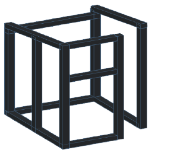
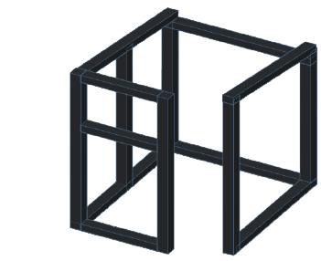
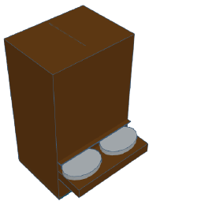
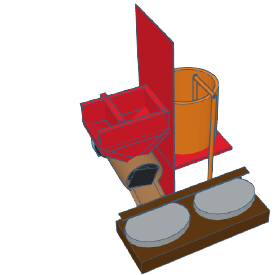
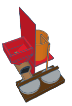
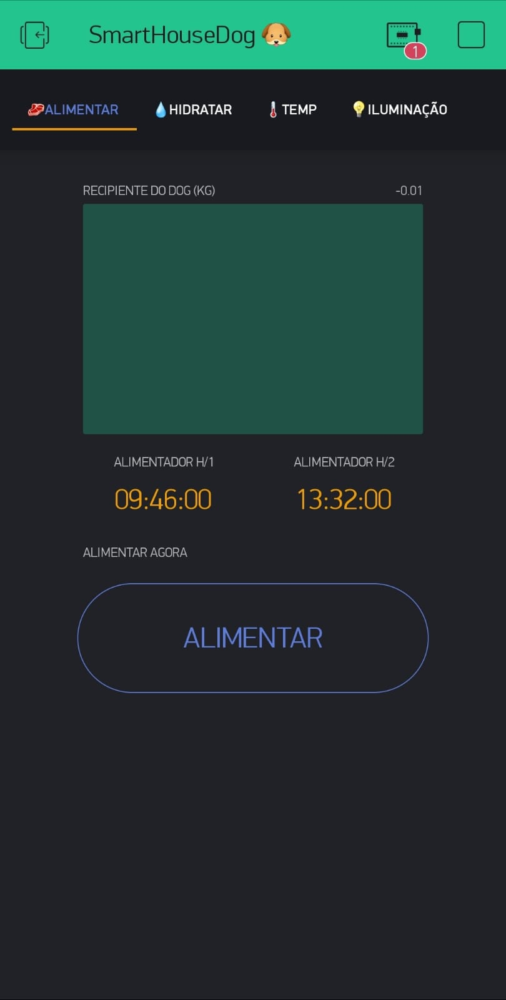
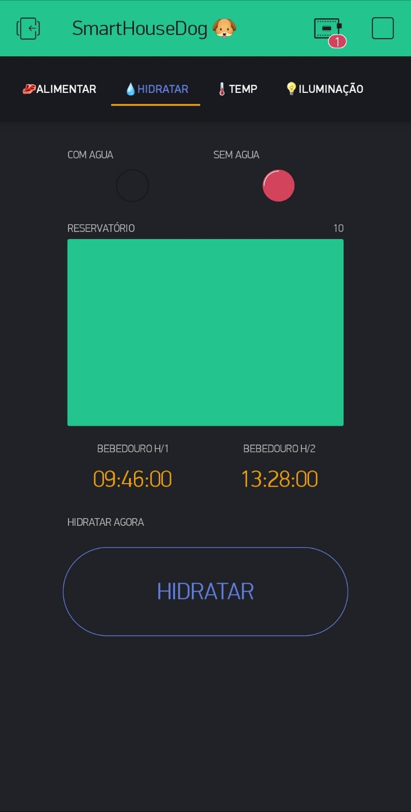
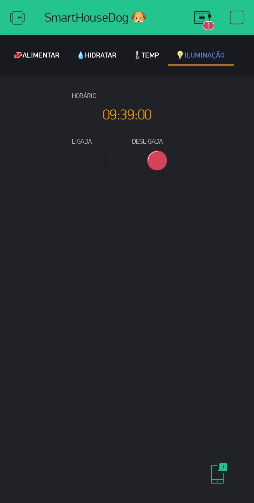
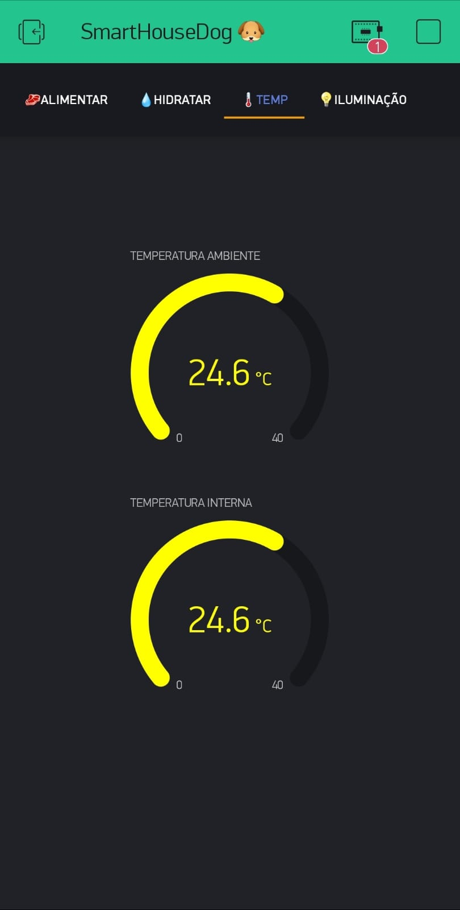
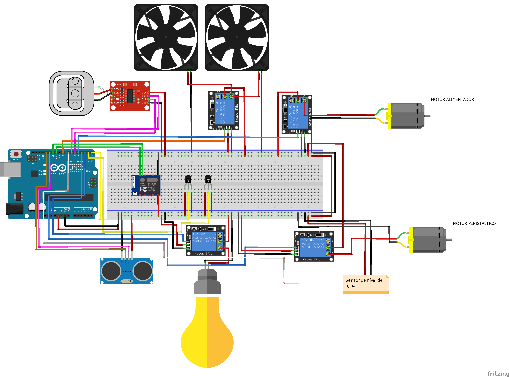

<html>

<p align="left">

</p>

<h1><p align="center">SMARTHOUSE DOG</p></h1>

<h3><b><i>SOBRE O PROJETO</i></b></h3>

>Smart House Dog se trata de um projeto de IOT, desenvolvido na disciplina de tecnologias aplicadas na 4ª fase do curso técnico de informática SATC.

<br>

<hr size="4" width="100%" color="#0E0B16">


<h3><b><i>OBJETIVO</i></b></h3>

>O projeto consiste no desenvolvimento de uma casa inteligente para os cães, onde todo o controle é feito através do smartphone com o intuito de trazer o conforto para o seu cãozinho e comodidade para seu dono. </p>

<br>
<hr size="4" width="100%" color="#0E0B16">

<h3><b><i>BENEFÍCIOS</i></b></h3>

- Controlar a distancia, basta uma conexão com wi-fi.<br> 
- Não se preocupar com a alimentação, pois a casa fará todo o processo.<br>
- Um cantinho aconchegante para seu melhor amigo.<br>
- Informações sobre a casa em seu Smartphone.<br>
- A casa possui um detalhe minimalista, porém muito aconchegante.<br>
- Baixo custo.<br>

<br>
<hr size="4" width="100%" color="#0E0B16">

<h3><b><p align="center">ESTRUTURA SMARTHOUSE DOG</p></h3></b>

<hr size="1" width="100%" color="#0E0B16">
<BR>

<h3><b><i>MODELO 3D COMPLETO</i></b></h3>

>- Telhado: telha sanduiche<br>
>- Parede externa: MDF<br>
>- Parede interna: xapadur<br>
>- Entre a parede: manta térmica<br>
>- Base: MDF<br>
>- Parede frontal: acrílico

<br>
<p align="left"></p>


<br><br><br>


<h3><b><i>ESQUELETO DA CASA</i></b></h3>


>- Comprimento: 70cm<br>
>- Largura: 60cm<br>
>- Altura frontal: 50cm<br>
>- Altura fundo: 40cm<br>
>- Material utilizado: metalom galvanizado

<br>

<p align="center">
</p>


<br><br>

<h3><b><i>ALIMENTADOR</i></b></h3>

>- Comprimento: 20cm<br>
>- Largura: 20cm<br>
>- Altura: 70cm<br>
>- Material utilizado: madeira

<br>

<p align="center">
</p>


<br><br>
<hr size="1" width="100%" color="#0E0B16">


<h3><b><p align="center">RECURSOS DA SMARTHOUSE DOG</p></h3></b>
<hr size="1" width="100%" color="#0E0B16">
<br><br>
<h3><b><i>COMUNICAÇÃO</i></b></h3>

>Você terá acesso a todas as informações do hardware através do seu SmartPhone. Além de notificações constantemente.

<br>

<h3><b><i>ALIMENTAÇÃO</i></b></h3>

>A alimentação será de forma automática (Timer) ou de forma remota, através do seu SmartPhone. Foi utilizado uma rosca sem fim (semelhante a um parafuso, em formato helicoidal fazendo com que seu movimento empurre a ração até um determinado local) e acima dela fica um grande reservatório, onde quando der o horário ou a pessoa ativar o alimentador, o programa verificará a celula de carga (semelhante a uma balança) que se localiza abaixo do pote de comida, e se indicar que não tem peso sobre ela (ou seja, nao tem ração) a rosca é ativada e desloca a ração até o potinho do cachorro, caso contrário, não acontecerá nada e o programa executará somente no próximo horário, repetindo a verificação.

<br>
 <p align="center">
 </p><br><br>

<h3><b><i>BEBEDOURO</i></b></h3>

>O bebedouro será de forma automática. O controle é dado por um timer totalmente alteravél em seu SmartPhone, ou se preferir, através de um botão manual. Foi utilizado um sensor de nível de água para fazer a verificação da quantidade presente no pote, seguindo a mesma lógica da alimentação. Ele irá verificar e caso não haja água no pote, ao chegar no horário,vai bombear a água de um reservatório (semelhante ao da ração) para o potinho do cachorro através de um motor peristáltico.

<br>
<p align="center"></p>
<br><br>

<h3><b><i>ILUMINAÇÃO</i></b></h3>

>A iluminação será de forma automática. O controle é dado por um timer totalmente alteravél em seu SmartPhone.

<br>
<p align="center"></p>

<br><br>

<h3><b><i>TEMPERATURA</i></b></h3>

>A casa conta com dois sensores de temperatura (DHT11) que fazem a medição da temperatura. Ficam localizados na parte dos componentes e na parte interna da casa. Caso esteja muito quente na parte dos componentes, são ativados os coolers para resfriar e não causar nenhum problema/dano. Já o outro faz a medição da temperatura do ambiente em que o cachorro está, e caso esteja muito quente, manda uma notificação para o dono o recomendando de dar uma voltinha com seu amigo. Os mostradores dentro do blynk mudam de cor conforme a temperatura. Se estiver baixa, muda para azul, indicando que está frio. Se estiver razoável, fica amarela, indicando que a temperatura está razoável. Se estiver alta, muda para vermelho, indcando que está quente no local.

<br>
<p align="center"></p>

<h3><b><i>ISOLAMENTO</i></b></h3>

>A casa conta com paredes que possuem revestimento em manta térmica, com obejtivo de reduzir a temperatura para que o cãozinho fique confortável.

<br>
<hr size="1" width="100%" color="#0E0B16">

<h3><b><p align="center">PLATAFORMA E LINGUAGEM</p></h3></b>

<hr size="1" width="100%" color="#0E0B16">
<br>
<h3><b><i>PLATAFORMA</i></b></h3>

> Para a realização do projeto, foi utilizado um Arduino Uno e toda a programação foi realizada na sua IDE. Foi utilizado o aplicativo Blynk para fazer o controle remoto.

<br>
<p align="center">

</p>
<br><br>

 "Mas o que é o arduino?"

>Arduino é uma plataforma eletrônica de código aberto baseada em hardware e software fáceis de usar. As placas Arduino são capazes de ler entradas - luz em um sensor, um dedo em um botão ou uma mensagem do Twitter - e transformá-la em uma saída - ativando um motor, ligando um LED, publicando algo online. Você pode dizer à sua placa o que fazer enviando um conjunto de instruções para o microcontrolador da placa.
<br>
<p align="center">
<br></p>
<br>
<br>

<h3><b>Linguagem</b></h3>

>A linguagem utilizada foi C++ que é uma linguagem de alto nível utilizada para programação em arduino.

<br>
<p align="center">
</p>

<br>
<hr size="1" width="100%" color="#0E0B16">


<h3><b><p align="center">HARDWARE E CÓDIGO</p></h3></b>

<hr size="1" width="100%" color="#0E0B16">

<h3><b><i>CIRCUITO</i></b></h3>

>O circuito foi montado através do software fritizing, representando o hardware exato do projeto. A sequência dos pinos nesta imagem podem estar diferentes das atuais. 

<p align="left">
<br></p>


<details>
&#x1F4BB;1x Arduino Uno<br>
&#x1F4BB;5x Relés<br>
&#x1F4BB;2x Coolers<br>
&#x1F4BB;2x Sensores de temperatura e umidade<br>
&#x1F4BB;1x ESP8266<br>
&#x1F4BB;1x Célula de carga e módulo<br>
&#x1F4BB;2x Resistores<br>
&#x1F4BB;1x Motor com redutor 30RPM<br>
&#x1F4BB;1x Motor peristáltico<br> 
&#x1F4BB;1x Luz externa<br>
&#x1F4BB;1x Sensor de Nível de Água<br>
&#x1F4BB;1x Sensor Ultrassônico
<summary><b>Componentes Utilizados &#x2714;</b> </summary>
</details>

<br><br>

<h3><b><i>CÓDIGO</i></b></h3>

>Como visto anteriormente, o projeto foi desenvolvido na IDE do arduino, utilizando a linguagem C++. Foram utilizadas algumas bibliotecas para o funcionamento dos sensores.


<details>
<br>

<p align="center">
<B>CÓDIGO DE TESTE DO SENSOR DE NÍVEL DE ÁGUA</B>
</p>
<br>

```C++
#define ReleMotor 3
#define SensorAgua 4
void setup() {
  pinMode(ReleMotor  , OUTPUT);
  pinMode(SensorAgua ,  INPUT);
  digitalWrite(ReleMotor, LOW);
  Serial.begin(9600);
}
void loop() {
 Ler_Sensor();
}
void Ler_Sensor()
{
 int ValorSensor = digitalRead(SensorAgua);
 Serial.println(ValorSensor);
  if(!ValorSensor)                 
  {                                      
     digitalWrite(ReleMotor, HIGH);            

  } 
  else                                    
  {                                       
     digitalWrite(ReleMotor, LOW);           
  } 

  }
```
<br><br>
<br>

<p align="center">
<b>CÓDIGO DE TESTE DA CÉLULA DE CARGA</b>
</P>
<BR>

```C++ 

#define RELEMOTOR 2
#include "HX711.h"                    
#define DOUT  A0                     
#define CLK  A1                       
HX711 balanca;          
float calibration_factor = 101790.00;     
void setup()
{
  pinMode(RELEMOTOR, OUTPUT);
  Serial.begin(9600);            
  balanca.begin(DOUT, CLK);      
  balanca.set_scale();                                             
  zeraBalanca ();                                                  
}
void zeraBalanca ()
{
  Serial.println();                                               
  balanca.tare();                                                
  Serial.println("Balança Zerada ");
}
void loop()
{
  balanca.set_scale(calibration_factor);                     
  Serial.print("Peso: ");                                   
  Serial.print(balanca.get_units(), 3);                      
  Serial.print(" kg");
  Serial.print("      Fator de Calibração: ");               
  Serial.println(calibration_factor);                       
   
}
```
<br><br>
<br>

<p align="center">
<b>CÓDIGO DE TESTE DHT11</b>
</p>
<br>

```C++ 
#include <DHT.h>
#include <DHT_U.h>
#define DHTPIN 10 
#define DHTTYPE DHT11   

DHT dht(DHTPIN, DHTTYPE);

void setup() {
  Serial.begin(9600);
  Serial.println(F("DHTxx test!"));
  dht.begin();
}

void loop() {


  float humidade = dht.readHumidity();

  float temperatura = dht.readTemperature();

  if (isnan(humidade) || isnan(temperatura)) {
    Serial.println(F("Falha ao ler do sensor DHT!"));
    return;
  }
  Serial.print(F("Humidade: "));
  Serial.println(humidade);
  Serial.print(F("Temperatura: "));
  Serial.println(temperatura);

}
```
<summary><b>Codigos testes &#x2714;</b> </summary>
</details>
<br><br>

<h3><b><i>BIBLIOTECAS</i></b></h3>

- [HX711](https://www.arduino.cc/reference/en/libraries/hx711-arduino-library/)
- [DHT](https://www.arduino.cc/reference/en/libraries/dht-sensor-library/)
- [Blynk](https://github.com/blynkkk/blynk-library/releases/tag/v1.0.1)
- [NewPing](https://playground.arduino.cc/Code/NewPing/#Download)

<br>

<hr size="1" width="100%" color="#0E0B16">

<h3><b><p align="center">DESENVOLVEDORES </b></h3>
</p>
<hr size="1" width="100%" color="#0E0B16">
<br>
<font face="Bahnschrift Condensed" size="5" color="#C1CDC1">
<p align="left">
&#x1F920; Olá, eu sou o Victor. 
</p></font>
<details>
<summary> <b>Um pouco mais sobre mim... </b><i>(Aperta aí)</i> </summary>
&#x1F4BB;Cursando Informática no Colégio Satc <br> 
&#x1F4BB;Aluno do 3° ano E.M do Colégio Satc <br>
&#x1F575;Futuro estagiário <br>
&#x1F5FA;Cocal do Sul-SC	


&#x1F4F2;Me siga no [instagram](https://www.instagram.com/victor__bonomi/?hl=pt-br)!
 

</details>
<br><br>
<font face="Bahnschrift Condensed" size="5" color="#C1CDC1">
<p align="left">
&#x1F920; Olá, eu sou o Vinicius. 
</p></font>
<details>
<summary> <b>Um pouco mais sobre mim... </b><i>(Aperta aí)</i> </summary>
&#x1F4BB;Cursando Informática no Colégio Satc <br> 
&#x1F4BB;Aluno do 3° ano E.M do Colégio Satc <br>
&#x1F575;Futuro estagiário <br>
&#x1F5FA;Criciúma-SC	


&#x1F4F2;Me siga no [instagram](https://www.instagram.com/vinidamiani_/?hl=pt-br)!
 

</details>
<br><br>
<h3><b><i>CONTATO</i></b></h3>

>- victorbonomi16@gmail.com - <b>Victor</b><br>
>- vinidamiani03@gmail.com - <b>Vinicius</b>


<br>


<p align = "center">
<a href = "https://chat.whatsapp.com/JAlEQSvuMBnHC49dplJw2Z"> </a>
</p>

<br>
&#x1F4D6;<i>“Uma máquina consegue fazer o trabalho de 50 homens ordinários. Nenhuma máquina consegue fazer o trabalho de um homem extraordinário”.<br> 
by: Elbert Hubbard. </i> 

</html>
