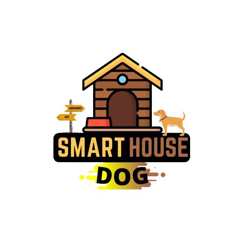
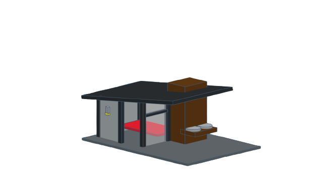
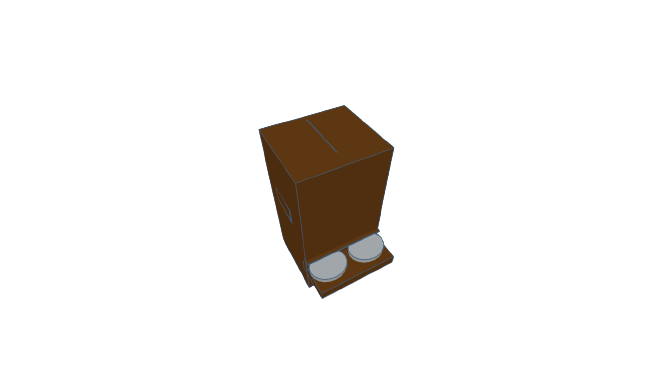
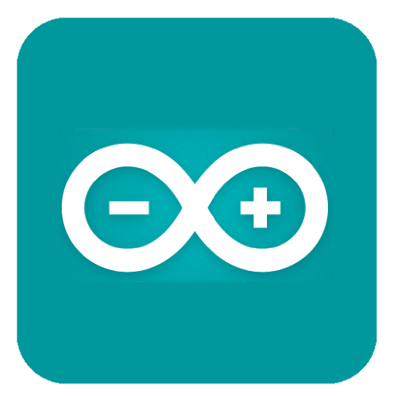
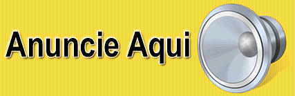

<html>

<p align="left">

</p>

<h1><p align="center">SmartHouse dog</p></h1>

<h3><b><p align="center">OBJETIVO </b></h3>
O projeto consiste no desenvolvimento de uma casa inteligente para os cães com o intuito de trazer o conforto para o seu cãozinho e comodidade para seu dono. </p>

<br><br>
<hr size="4" width="100%" color="#0E0B16">
<br><br>


<h3><b><p align="left">-Algumas imagens do desenvolvimento do projeto da casa(3D)</b></h3></p>
<h3><p align="left">Modelo 3D completo da SmartHouse dog</p></h3>

<details>
-Telhado: telha sanduiche<br>
-Parede externa: forro de pinus<br>
-Parede interna: xapadur<br>
-Entre a parede: manta térmica<br>
-Base: tábua de pinus<br>
-Parede frontal: acrílico<br>
<summary> <b>Especificações técnicas</b>
</details>

<br><br><br>

<h3><p align="left">Esqueleto da SmartHouse  dog</p></h3>

<details>
-Comprimento: 70cm<br>
-Largura: 60cm<br>
-Altura frontal: 50cm<br> 
-Altura fundo: 40cm<br>
-Material utilizado: metalom galvanizado<br>
<summary> <b>Dimensões</b>
</details>

<br><br><br>

<h3><p align="center">ALIMENTADOR</p></h3>

<details>
-Comprimento: 20cm<br>
-Largura: 20cm<br>
-Altura: 70cm<br> 
-Material utilizado: madeira<br>
<summary> <b> Alimentador</b>
</details>
</p>

<br><br>
<hr size="4" width="100%" color="#0E0B16">
<br><br>

<h2><b><p align="left">Recursos</p></h2></b>
<b>ALIMENTAÇÃO</b><br>
A alimentação será de forma automática(Timer)
 ou de forma remota. através do seu SmartPhone<br><br>

<b>ILUMINAÇÃO</b><br>
A iluminação será de forma automática. O controle é dado por um timer totalmente alteravél em seu SmartPhone.<br><br>

<b>ISOLAMENTO</b><br>
A casa conta com paredes que possuem revestimento em manta térmica.<br><br>

<b>COMUNICAÇÃO</b><br>
Você terá acesso a todas as informações dis hardware através do seu SmartPhone. Além de notificações constantemente.
<br><br><br><br>

<h2><b>Plataforma e Hardware</b></h2>
<br>	
-Para a realização do projeto na parte de hardware, foi utilizado um Arduino Uno. Para inserir a programação utilizamos sua IDE.<br>
<p align="center">
</p>
<br><br>

<i>"Mas o que é o arduino?"</i>
<br>
-Arduino é uma plataforma eletrônica de código aberto baseada em hardware e software fáceis de usar. As placas Arduino são capazes de ler entradas - luz em um sensor, um dedo em um botão ou uma mensagem do Twitter - e transformá-la em uma saída - ativando um motor, ligando um LED, publicando algo online. Você pode dizer à sua placa o que fazer enviando um conjunto de instruções para o microcontrolador da placa.
<br>
<p align="center">
<br></p>
© 2021 Arduino Política de Privacidade
<br>
<br>

<h2><b>Linguagem</b></h2>
<br>
<p align="center">
<br></p>
-A linguagem utilizada foi C++ que é uma linguagem de alto nível utilizada para programação em arduino.
<br><br>


<details>
&#x1F4BB;1x Arduino Uno<br>
&#x1F4BB;5x Relés<br>
&#x1F4BB;2x Coolers<br>
&#x1F4BB;2x Sensores de temperatura e umidade<br>
&#x1F4BB;1x ESP8266<br>
&#x1F4BB;1x Célula de carga e módulo<br>
&#x1F4BB;2x LEDS<br>
&#x1F4BB;2x Resistores<br>
&#x1F4BB;1x Motor com redutor 30RPM<br>
&#x1F4BB;1x Motor peristáltico<br> 
&#x1F4BB;1x Luz externa<br>
&#x1F4BB;1x Sensor de Nível de Água
<summary><b>Componentes Utilizados &#x2714;</b> </summary>
</details>


<br><br>


<details>
<br>

<p align="center">
<B>CÓDIGO DE TESTE DO SENSOR DE NÍVEL DE ÁGUA</B>
</p>
<br>

```C++
#define ReleMotor 3
#define SensorAgua 4
void setup() {
  pinMode(ReleMotor  , OUTPUT);
  pinMode(SensorAgua ,  INPUT);
  digitalWrite(ReleMotor, LOW);
  Serial.begin(9600);
}
void loop() {
 Ler_Sensor();
}
void Ler_Sensor()
{
 int ValorSensor = digitalRead(SensorAgua);
 Serial.println(ValorSensor);
  if(!ValorSensor)                 
  {                                      
     delay(2000);
     digitalWrite(ReleMotor, HIGH);            

  } 
  else                                    
  {                                       
     delay(2000);
     digitalWrite(ReleMotor, LOW);           
  } 

  }
```
<br><br>
<br>

<p align="center">
<b>CÓDIGO DE TESTE DA CÉLULA DE CARGA</b>
</P>
<BR>

```C++ 

#define RELEMOTOR 2
#include "HX711.h"                    
#define DOUT  A0                     
#define CLK  A1                       
HX711 balanca;          
float calibration_factor = 101790.00;     
void setup()
{
  pinMode(RELEMOTOR, OUTPUT);
  Serial.begin(9600);            
  balanca.begin(DOUT, CLK);      
  balanca.set_scale();                                             
  zeraBalanca ();                                                  
}
void zeraBalanca ()
{
  Serial.println();                                               
  balanca.tare();                                                
  Serial.println("Balança Zerada ");
}
void loop()
{
  balanca.set_scale(calibration_factor);                     
  Serial.print("Peso: ");                                   
  Serial.print(balanca.get_units(), 3);                      
  Serial.print(" kg");
  Serial.print("      Fator de Calibração: ");               
  Serial.println(calibration_factor);                       
  delay(500) ;  
}
```
<br><br>
<br>

<p align="center">
<b>CÓDIGO DE TESTE DHT11</b>
</p>
<br>

```C++ 
#include <DHT.h>
#include <DHT_U.h>
#define DHTPIN 10 
#define DHTTYPE DHT11   

DHT dht(DHTPIN, DHTTYPE);

void setup() {
  Serial.begin(9600);
  Serial.println(F("DHTxx test!"));
  dht.begin();
}

void loop() {

  delay(2000);

  float humidade = dht.readHumidity();

  float temperatura = dht.readTemperature();

  if (isnan(humidade) || isnan(temperatura)) {
    Serial.println(F("Falha ao ler do sensor DHT!"));
    return;
  }
  Serial.print(F("Humidade: "));
  Serial.println(humidade);
  Serial.print(F("Temperatura: "));
  Serial.println(temperatura);

}
```
<summary><b>Codigos &#x2714;</b> </summary>
</details>
<br><br>
<br>


<b>Benefícios</b><br>
-Controlar a distancia, basta uma conexão com wi-fi.<br>
-Não se preocupar com a alimentação, pois a casa fará todo o processo.<br>
-Um cantinho aconchegante para seu melhor amigo.<br>
-Informações sobre a casa em seu Smartphone.<br>
-A casa possui um detalhe minimalista, porém muito aconchegante.<br>
-Baixo custo.<br>

<br><br>

<h4 align="center"> 
	🚧Em construção... 🚧
</h4>

- [ ] Construção Física da Casa
- [ ] Construção Física do Alimentador
- [x] Códigos e Testes dos Componenetes

<br><br>

<p align = "center">
<a href = "https://api.whatsapp.com/send?phone=5548996301654&text=Vinicius%20Damiani">
</p>

</html>
