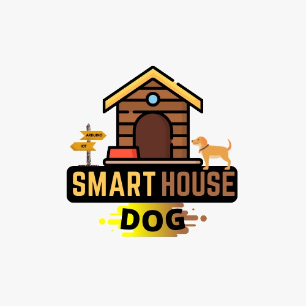
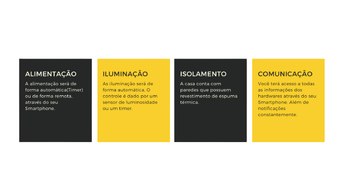

<html>

SmartHouse dog

<b>-Objetivo </b>

O projeto consiste no desenvolvimento de uma casa inteligente para os cães com o intuito de trazer o conforto para o seu cãozinho e comodidade para seu dono. 

  

  

<b>-Algumas imagens do desenvolvimento do projeto da casa(3D)</b> 

Modelo 3D completo da SmartHouse dog 

-Telhado: telha sanduiche 
-Parede externa: forro de pinus 
-Parede interna: xapadur 
-Entre a parede: manta térmica 
-Base: tábua de pinus 
-Parede frontal: acrílico 

 <b>Especificações técnicas</b>

   

Esqueleto da SmartHouse dog 

-Comprimento: 70cm 
-Largura: 60cm 
-Altura frontal: 50cm  
-Altura fundo: 40cm 
-Material utilizado: metalom galvanizado 

 <b>Dimensões</b>

   

Alimentador  

-Comprimento: 20cm 
-Largura: 20cm 
-Altura: 70cm  
-Material utilizado: madeira 

 <b>Especificações Alimentador</b>

  

&#10148; Recursos 

 

Plataforma e Hardware 
 	

-Para a realização do projeto na parte de hardware, foi utilizado um Arduino Uno. Para inserir a programação utilizamos sua IDE. 

  

<i>"Mas o que é o arduino?"</i>
 

-Arduino é uma plataforma eletrônica de código aberto baseada em hardware e software fáceis de usar. As placas Arduino são capazes de ler entradas - luz em um sensor, um dedo em um botão ou uma mensagem do Twitter - e transformá-la em uma saída - ativando um motor, ligando um LED, publicando algo online. Você pode dizer à sua placa o que fazer enviando um conjunto de instruções para o microcontrolador da placa.

 
 

© 2021 Arduino Política de Privacidade (Colocar link)

 
 

Linguagem	
 
 
-C++ é uma linguagem de alto nível utilizada para programação em arduino.
  

Componentes utilizados
	
 
-1 Arduino Uno 
-5 Relés 
-2 Coolers 
-2 Sensores de temperatura e umidade 
-1 ESP8266 
-1 Célula de carga e módulo 
-2 LEDS 
-2 Resistores 
-1 Motor com redutor 30RPM 
-1 Motor peristáltico  
-1 Luz externa

  
  

Códigos
	

  
  

Consumo e dados técnicos
	

  
  

Benefícios 
-Controlar a distancia, basta uma conexão com wi-fi. 
-Não se preocupar com a alimentação, pois a casa fará todo o processo. 
-Um cantinho aconchegante para seu melhor amigo. 
-Informações sobre a casa em seu Smartphone. 
-A casa possui um detalhe minimalista, porém muito aconchegante. 
-Baixo custo. 

  
  

<a href = "https://api.whatsapp.com/send?phone=5548996301654&text=Vinicius%20Damiani">

</body>
</html>
