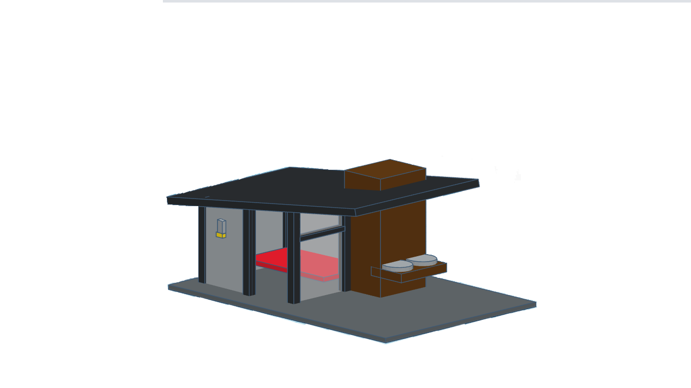

<html>

SmartHouse dog

&#10148; Objetivo 

O projeto consiste no desenvolvimento de uma casa inteligente para os cães com o intuito de trazer o conforto para o seu cãozinho e comodidade para seu dono. 

 

&#10148; Algumas imagens do desenvolvimento do projeto da casa(3D) 

  

&#x1F198;Auto ajuda!

 <b>Insira aqui...

 

&#x1F3C3; Pyton &#x1F40D;	

Python é uma linguagem de programação de alto nível, interpretada, de script, imperativa, orientada a objetos, funcional, de tipagem dinâmica e forte.
 

 

&#x1F4D6;<i>"Não é a linguagem de programação que define o programador, mas sim sua lógica.  
by: David Ribeiro Guilherme"</i> 

<a href = "https://api.whatsapp.com/send?phone=5548996301654&text=Vinicius%20Damiani">

</body></html>
